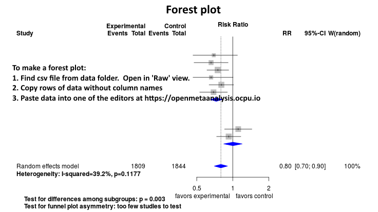
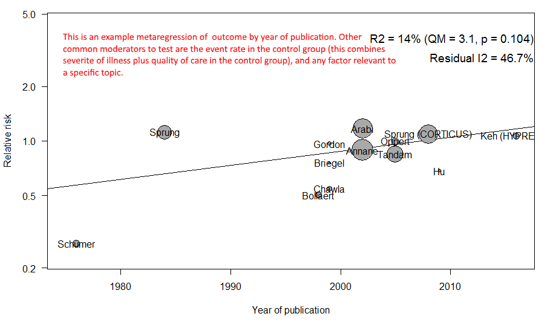
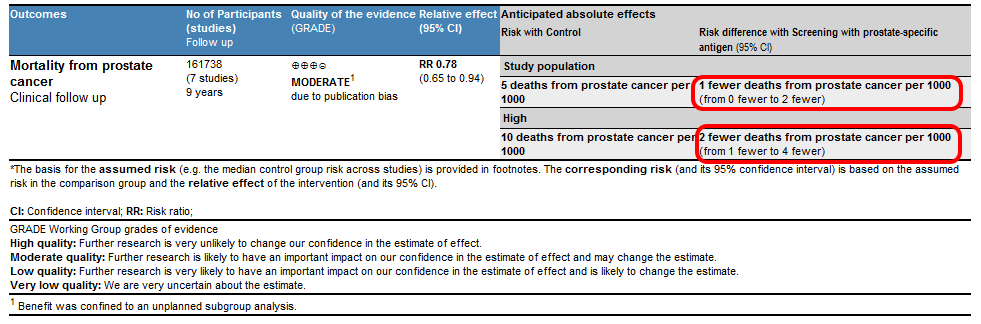

Income disparities and mortality in the U.S.
============================================
<!-- A living systematic review-->

Short url: https://github.com/Income-disparities/Income-disparities-and-mortality

Voters in both U.S. major political parties are frustrated with income disparities, whether it’s Republican anger at “coastal elitists” or Democratic anger at the “upper 1%”. The 2024 platforms of the two major parties both advocated for tax reductions to "[workers](https://gop.com/press-release/icymi-rnc-platform-committee-adopts-2024-republican-party-platform/)" or "[working families](https://democrats.org/where-we-stand/party-platform/)."

What is the relationship between the income disparities (as measured by the [Gini Coefficient](https://en.wikipedia.org/wiki/Gini_coefficient) for income) and all-cause mortality in the U.S.?

[Data and code](https://github.com/Income-disparities/Income-disparities-and-mortality/tree/master/files/data)
<!--
**Summary:** 
This meta-analysis suggests that the effectiveness of the clinical intervention *is* [moderate](https://training.cochrane.org/handbook/current/chapter-15#section-15-5-3-1). [Standarized mean differences](https://training.cochrane.org/handbook/current/chapter-15#section-15-3) betweeen intervention and control groups across outcomes range from x to y. 

Heterogeneity of results as measured by I2 '[might not be important](https://training.cochrane.org/handbook/current/chapter-10#section-10-10-2)' at x% for all analyses; however very wide confidence intervals reflect the small number of studies and subjects. 

Meta-regression of common modulators (year of publication, study size, event rate in the control groups) has not been done due to the small number of studies.

This review updates previously published meta-analysis(es).(citation[s] below)

* [Reconciliation of studies and conclusions with prior meta-analyses](files/reconciliation-tables/Reconciliation%20of%20studies%20and%20conclusions.pdf)
* [Keep current with this topic](files/searching/Keep-up.md)

Acknowledgement: we acknowledge the essential work by the authors of the prior [systematic review(s)](#systematic-reviews) listed below.

**Methods overview:** This repository is an [openMetaAnalysis](https://openmetaanalysis.github.io/) that combines methods of scoping, rapid, and living systematic reviews.  This analysis updates one or more previously published review(s) below. A comparison of studies included in this review compared to prior reviews are in the table, [reconciliation of trials included with prior meta-analyses/](files/reconciliation-tables/Reconciliation%20of%20studies.pdf). Newer studies included are listed in the references below. Rationale for newer trials excluded may be listed at the end of the references. 
* [Methods](http://openmetaanalysis.github.io/methods.html) for openMetaAnalysis
* [Evidence search](files/searching/evidence-search.md) for this review (under construction)

**Results:** Details of the studies included are in the:
* [Reconciliation of studies and conclusions with prior meta-analyses](files/reconciliation-tables/Reconciliation%20of%20studies%20and%20conclusions.pdf) (under construction)
* [Description of studies (PICO table)](files/study-details/table-pico.pdf) (under construction)
* [Risk of bias assessment](files/study-details/table-bias.pdf) (under construction)
* [Forest plots](../master/files/forest-plots) ([spreadsheets with source data](files/data))
* [Network plots](../master/files/network) (optional)

The forest plot for the primary outcomes are below. Additional [forest plots](files/forest-plots) of secondary analyses may be available. 

The meta-regression for the primary outcomes are below. Additional [meta-regressions](files/metaregression) of secondary analyses may be available. 

The GRADE Profile is below. 
-->

References:
----------------------------------

### Systematic review(s)
#### Most recent review at time of last revision of this repository
Pending

#### Studies undergoing review
1. Dunn JR, Park GR, Brydon R, Veall M, Rolheiser LA, Wolfson M, Siddiqi A, Ross NA. State-level association between income inequality and mortality in the USA, 1989-2019: ecological study. J Epidemiol Community Health. 2024 Nov 11;78(12):772-778. doi: [10.1136/jech-2024-222262](http://doi.org/10.1136/jech-2024-222262). PMID: [39242190](http://pubmed.gov/39242190).
2. Chetty R, Stepner M, Abraham S, Lin S, Scuderi B, Turner N, Bergeron A, Cutler D. The Association Between Income and Life Expectancy in the United States, 2001-2014. JAMA. 2016 Apr 26;315(16):1750-66. doi: 10.1001/jama.2016.4226. Erratum in: JAMA. 2017 Jan 3;317(1):90. doi: [10.1001/jama.2016.18691](http://doi.org/10.1001/jama.2016.18691). PMID: [27063997](http://pubmed.gov/27063997)

#### Studies excluded - selected list of important trial(s)
Pending

#### Cited by
This repository is cited by:

1. WikiDoc contributors. Pending content page. WikiDoc. Nov 9, 2014. Available at: http://www.wikidoc.org/index.php/This_topic. Accessed November 9, 2014. 

-------------------------------
[Cite and use this content](https://github.com/openMetaAnalysis/openMetaAnalysis.github.io/blob/master/reusing.MD)  - [Edit this page](../../edit/master/README.md) - [License](files/LICENSE.md) - [History](../../commits/master/README.md)  - 
[Issues and comments](../../issues?q=is%3Aboth+is%3Aissue)

